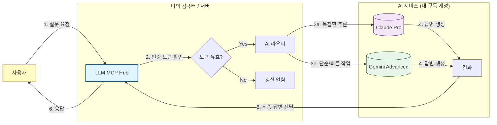

# 서비스 기획서: LLM MCP Hub

## 1. 서비스 개요 (Service Overview)

**LLM MCP Hub**는 개인이 보유한 **월정액 AI 구독(Claude Pro, Gemini Advanced)** 계정을, 마치 **API처럼 활용**할 수 있도록 변환해주는 **"AI 게이트웨이"** 서비스입니다.

복잡한 개발 도구(Cursor, VS Code)나 자동화 툴(n8n)에서 별도의 비싼 API 요금을 내지 않고, 이미 결제한 구독 플랜을 그대로 사용하여 비용을 0원으로 만드는 것이 핵심 목표입니다.

---

## 2. 기획 배경 및 목적 (Background & Goals)

### 2.1 문제점 (Pain Points)
*   **이중 지출**: 이미 Claude Pro($20)와 Gemini Advanced($20)를 매월 결제하고 있지만, 외부 툴(n8n, Cursor)을 연동하려면 별도로 건당 요금이 부과되는 **"API Key"**를 또 발급받아야 합니다.
*   **비용 부담**: 개발이나 자동화 작업을 많이 하면 API 비용이 월 수십~수백 달러까지 치솟을 수 있습니다.
*   **파편화**: Claude와 Gemini를 각기 다른 방식으로 연동해야 해서 관리가 불편합니다.

### 2.2 해결 방안 (Solution)
*   **구독 활용**: 내 계정의 브라우저/CLI 권한(OAuth Token)을 안전하게 추출하여, API Key 없이도 AI를 호출할 수 있는 "허브(Hub)"를 구축합니다.
*   **통합 인터페이스**: Claude든 Gemini든 상관없이 하나의 통일된 주소로 요청을 보낼 수 있습니다.

### 2.3 기대 효과 (Business Value)
1.  **비용 절감**: 추가 API 비용 **$0** (기존 구독료 내에서 해결).
2.  **생산성 향상**: n8n 같은 자동화 툴에서 마음껏 AI를 사용하여 업무 자동화 가능.
3.  **확장성**: 추후 다른 AI 모델이 나와도 이 허브만 업데이트하면 모든 툴에 자동 적용.

---

---

## 3. 서비스 흐름 (Service Flow)

사용자가 질문을 던지면, **LLM MCP Hub**가 이를 받아서 적절한 AI(Claude/Gemini)에게 전달하고 답변을 받아옵니다. 이 모든 과정은 **무료(구독 포함)**로 처리됩니다.

---

## 4. 주요 기능 (Key Features)

### 3.1 통합 채팅 API (Unified Chat API)
*   개발 도구나 자동화 프로그램이 *"질문(Prompt)"*을 던지면, 설정된 AI(Claude 또는 Gemini)에게 대신 물어보고 *"답변"*을 받아옵니다.
*   마치 공식 유료 API를 쓰는 것과 똑같이 동작하지만, 실제로는 내 구독 계정을 사용합니다.

### 3.2 MCP 서버 지원 (AI Agent 연결)
*   **MCP(Model Context Protocol)**는 최신 AI 트렌드 기술입니다.
*   Claude Desktop App이나 Cursor 같은 최신 에디터에서 이 허브를 "도구"로 인식하여, 내 컴퓨터의 정보를 안전하게 AI와 주고받을 수 있습니다.

### 3.3 스마트 라우팅 (Smart Routing) - *Future*
*   질문의 난이도에 따라 똑똑하게 AI를 골라줍니다.
    *   간단한 번역/요약 → **Gemini** (빠르고 저렴/무제한에 가까움)
    *   복잡한 코딩/추론 → **Claude** (성능이 좋음)

---

## 5. 사용자 시나리오 (Use Cases)

### 시나리오 A: "n8n"으로 뉴스 요약 자동화
1.  **사용자**: 매일 아침 IT 뉴스를 수집하는 n8n 워크플로우를 실행.
2.  **기존**: 뉴스 100개를 요약하려면 API 비용이 꽤 발생하여 망설임.
3.  **Hub 사용**: LLM MCP Hub로 뉴스 전문을 보냄. 추가 비용 0원으로 100개 기사 요약 완료.

### 시나리오 B: "Cursor"로 코딩 보조
1.  **사용자**: IDE에서 "이 코드 리팩토링해줘"라고 요청.
2.  **Hub 사용**: 내 Claude Pro 계정을 통해 답변을 생성. 월 20달러 구독료 외에 추가 API 과금 걱정 없이 무제한 질문 가능.

---

## 6. 추진 일정 (Milestones)

*   **1단계 (기반 구축)**: 핵심 서버 개발 및 Claude/Gemini 기본 연동. (가장 중요)
*   **2단계 (안정화)**: 연결이 끊기지 않도록 OAuth 토큰 관리 및 자동 갱신 기능 구현.
*   **3단계 (확장)**: 스마트 라우팅 및 관리자 대시보드(토큰 상태 확인용) 추가.

---

## 7. 리스크 및 대응 (Risks & Mitigation)

| 리스크 항목 | 내용 설명 | 대응 방안 (Mitigation) |
| :--- | :--- | :--- |
| **연결 불안정** | 구글/Claude의 로그인(토큰)이 풀리면 작동이 멈출 수 있음 | • 토큰 만료 3일 전 알림 발송 • 기술 검토(POC)를 통해 가장 안정적인 연결 방식(Direct API) 채택 예정 |
| **사용량 제한** | 구독 계정도 하루 사용량 제한(Rate Limit)이 있음 | • 개인용/소규모 팀용으로만 사용 권장 • 사용량이 폭증하면 그 때 공식 API Key 방식으로 전환 가능한 "하이브리드 모드" 지원 |
| **정책 위반** | 개인 계정을 상업적 대규모 서비스에 쓰면 차단될 수 있음 | • **내부 도구(Internal Tool) 및 개인 비서 용도**로만 활용하여 리스크 최소화 |
